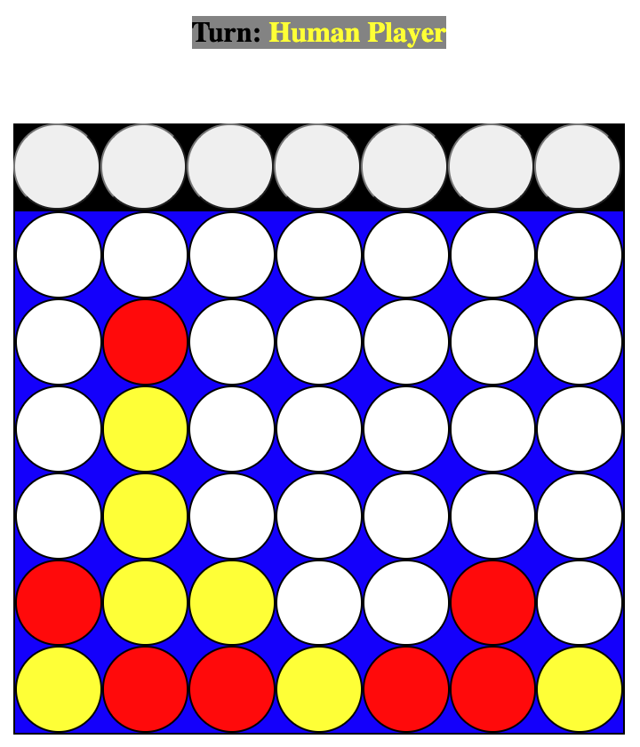
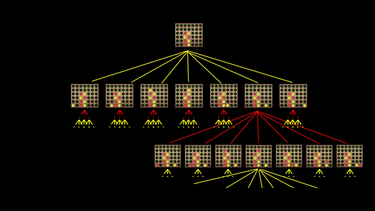

# Connect 4 (with MiniMax AI)

### **Live Link: [Connect 4](https://codepen.io/nathanieldcooke/pen/zYwoYvq)**

_Connect 4_, is a two player game, in-which players take turns dropping their colored tokens into one of seven available slots. The winner is whoever is able to get four of their tokens to line up vertically, horizontally, or diagonally.

<a href="https://codepen.io/nathanieldcooke/pen/zYwoYvq" target="_blank" rel="noopener noreferrer"></a>

### Why this project

During this hackathon groups of 1-3 we're tasked with building a toy project, that utilized the topic of the week... Trees. 

### Integration of Trees in project

Having to work with trees on this project. I accomplished building a move tree, then traversing the move tree with the well know MiniMax algorithm. This creates an AI capable of making meaningful/competitive moves, during game play. 

* Building Move Tree




`./javascript/computerPlayer.js`
```js
buildTree(depthLimit, boardState, currPlayer = 'red') {
        this.root = new Node(boardState, 0, null);

        // loop to generate children;
        let nodes = [this.root];
        let childrenNodes = [];
        for (let j = depthLimit; j > 0; j--){
            nodes = nodes.concat(childrenNodes);
            childrenNodes = [];
            while(nodes.length) {
                let currNode = nodes.pop()
                for (let i = 0; i < 7; i++) {
                    let col = i;
        
                    if (currNode.boardState[0][col]) continue;
                    
                    // dupe board
                    let boardStateDupe = currNode.boardState.map(row => {
                        let newRow = [];
                        row.forEach(el => {
                            newRow.push(el);
                        })
                        return newRow;
                    }) 
        
                    // make move on dup of root board.
                    let row = this.board.dropPiece(boardStateDupe, col, currPlayer);
                    
                    // determine if next move is win, nuetral, or lose
                    let win = this.board.winner(boardStateDupe, row, col, currPlayer);
                    let moveVal = null;
        
                    if (win && currPlayer === 'red') {
                        moveVal = 1;
                    } else if (win && currPlayer === 'yellow') {
                        moveVal = -1;
                    } else if (!win) {
                        moveVal = 0;
                    } 
                    // generate child node of root
                    let childNode = new Node(boardStateDupe, moveVal, col)
                    currNode.children.push(childNode)
                    if (moveVal === 0) childrenNodes.push(childNode)
                }
            }
            currPlayer = currPlayer === 'red' ? 'yellow' : 'red'
        }
    }Arr, passwordArr, confirmPasswordArr]);
```

* Run MiniMax Algorithm on Move Tree nodes

<a href="https://www.youtube.com/watch?v=l-hh51ncgDI&t=279s" target="_blank" rel="noopener noreferrer"></a>

`./javascript/computerPlayer.js`
```js
    minimax(node, isMax = true) {
        if (node.val === -1 || node.val === 1) return node.val;
        
        if (isMax) {
            let maxEval = -Infinity;
            node.children.forEach(child => {
                let val = this.minimax(child, false);
                maxEval = Math.max(maxEval, val);
            });
            return maxEval;
        } else {
            let minEval = Infinity;
            node.children.forEach(child => {
                let val = this.minimax(child, true);
                minEval = Math.min(minEval, val);
            });
            return minEval;
        }
    }
```

## Future Implementations 
- Minimax can have further optimizations for determining the next best move. Such as accounting for the depth of win/lose game nodes, to determine the nearest wins or loses, to the root board state. 
- Optimizing for big-o time/space complexities
- Adding a visualization of the Move Tree

## Connect4 Developer
- [@nathanieldcooke](https://github.com/nathanieldcooke)